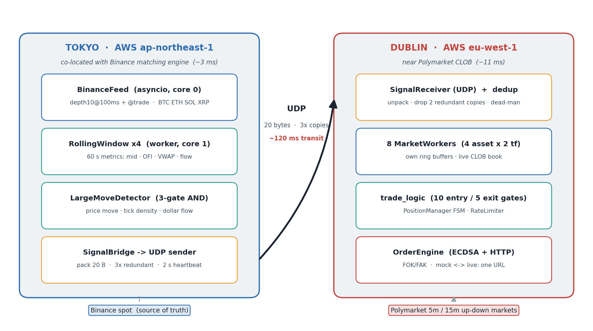
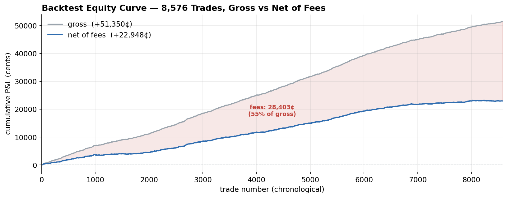
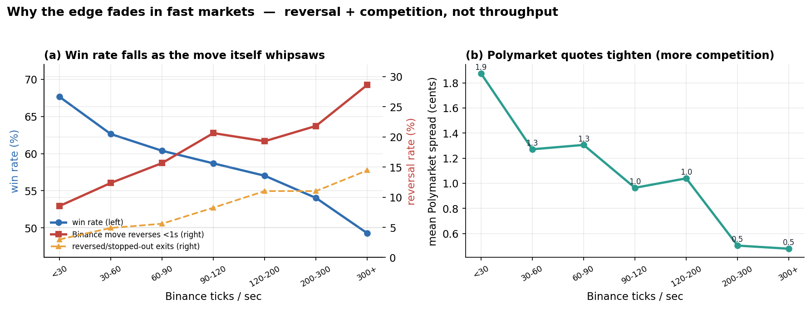

# Low-Latency Cross-Venue Arbitrage: Binance → Polymarket

**Strategy, infrastructure, deployment, and a production post-mortem.**

📄 **[Read the full write-up (PDF)](Polymarket_low_latency_writeup.pdf)**

A two-node, cross-continent low-latency trading system built to exploit the lag with
which Polymarket's short-dated crypto ("up/down") markets reprice against Binance
spot. The system was calibrated on recorded data, validated in replay, deployed to
AWS, and traded with real capital. It was profitable in backtest and lost money live,
for a single, instructive reason.

---

## The one-paragraph version

A **Tokyo** node (AWS `ap-northeast-1`, next to Binance) detects directional moves on
the Binance order book with a three-gate detector and fires a 20-byte UDP signal to a
**Dublin** node (AWS `eu-west-1`, next to Polymarket), which executes fill-and-kill
orders on the correct outcome token before the Polymarket book catches up. End-to-end
latency was **~140–150 ms**, dominated by the transatlantic hop. In an 8,576-trade
replay backtest the strategy won **61.4%** with a coherent, well-structured edge. Live,
**only ~1 order in 10 filled**: the displayed Polymarket depth was largely **spoofed**,
cancelled the instant a real order tried to cross it. The latency edge was real; the
liquidity it was racing toward was not.

## Headline numbers (replay backtest, paper fill assumption)

| Metric | Value |
|---|---|
| Trades | 8,576 across ~52 h of recorded order flow (5-minute markets) |
| Win rate | 61.4% |
| Gross / fees / net | +51,350¢ / 28,403¢ (55% of gross) / +22,948¢ |
| Median hold | 7.6 s |
| Repricing half-life | ~786 ms |
| End-to-end latency | ~140–150 ms (measured) |
| Infra cost | 2 × `c6a.large`, ~$100/month |
| **Live fill rate** | **~10% (vs ~100% in paper)** |

## System architecture



## Selected results

The empirical edge (Polymarket repricing toward the signal, decaying after ~2 s), the
gross-vs-net equity curve showing the 55% fee drag, and the decomposition of why the
edge fades in fast markets (reversal + competition, not system throughput):





---

## Repository layout

| File | Description |
|---|---|
| `Polymarket_low_latency_writeup.pdf` | Compiled write-up (start here) |
| `Polymarket_low_latency_writeup.tex` | LaTeX source |
| `tmsce.cls` | Document class |
| `make_figures.py` | Figure-generation script (matplotlib) |
| `fig_*.png` | Figures used in the write-up |

## Building the PDF

Compile with any LaTeX toolchain (two passes for the table of contents and
cross-references), e.g.:

```bash
pdflatex Polymarket_low_latency_writeup.tex
pdflatex Polymarket_low_latency_writeup.tex
```

or upload the `.tex`, `tmsce.cls`, and `fig_*.png` to [Overleaf](https://www.overleaf.com).

The figures are committed pre-generated. `make_figures.py` reproduces them from the
underlying recorded backtest datasets (`regime_trade_log.parquet`,
`edge_signals.parquet`), which are not included in this repository.

---

*Author: Cullen Trace Campana.*
